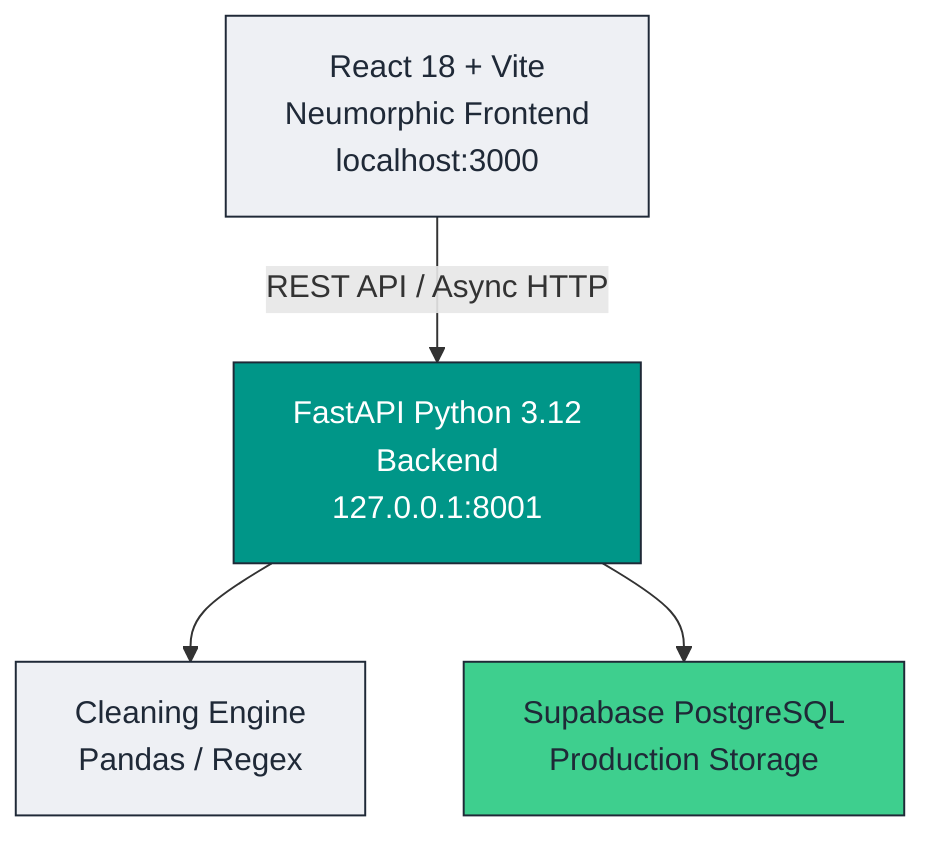

<div align="center">

# 🏔️ DataLink Engine
### Real Estate Data Normalization & Ingestion Platform

A commercial-grade, multi-register real estate data ingestion, normalization, and deduplication engine — built on a **FastAPI + Supabase PostgreSQL** backend with a **White & Light Grey Neumorphic** React frontend.

[](https://fastapi.tiangolo.com/)
[](https://react.dev/)
[](https://vitejs.dev/)
[](https://supabase.com/)
[](https://www.python.org/)
[](#-copyright--license)

[Features](#-key-features) • [Architecture](#-architecture-overview) • [Getting Started](#-getting-started) • [API Reference](#-api-endpoint-reference) • [Structure](#-repository-structure)

</div>

<br/>

> **What changed recently:** cross-register deduplication, Property Type
> enrichment from portal data (40% → 82%), record lineage with reprocessing,
> a worker process for ingest, an outreach layer whose call verdicts feed back
> into data quality, and PDPL opt-out and erasure. Full detail in
> [CHANGELOG.md](CHANGELOG.md).

## 🌟 Key Features

<table>
<tr>
<td width="33%" valign="top">

### 🎨 Neumorphic UI

Tactile soft-3D design system built on `#EEF0F4`, with debossed inset controls, dual-shadow cards, and clean slate typography (`#1F2937`).

Fixed `100vh` layout — sidebar, search, and filters stay pinned while data tables scroll independently.

Custom Neumorphic `<CustomSelect />` replaces native browser dropdowns with floating popover cards.

</td>
<td width="33%" valign="top">

### ⚡ Batch Studio

Drag-and-drop ingestion of 1–20+ Excel or CSV builder registers at once.

Header Remapping Studio compares raw columns against 23 canonical fields, with manual override support.

Configurable batch engine (250 / 500 / 1000 rows per chunk) with live progress tracking.

</td>
<td width="33%" valign="top">

### 🧹 Cleaning Engine

International phone standardizer, normalizing to ITU E.164 format across UAE and global prefixes.

Unit conversion: sq.m → sq.ft (`× 10.7639`).

Developer Reference Resolver maps naming variants (`EMAAR`, `Emaar Properties PJSC`, `EMAAR PROPERTIES L.L.C` → `Emaar Properties`) to canonical entities, with owner/buyer and developer fields kept strictly decoupled. Placeholder values (`Multiple private developers`, `Various`) are dropped rather than stored as builders.

</td>
</tr>
</table>

<br/>

## 🏗️ Architecture Overview



<br/>

## 🛠️ Tech Stack

| Layer | Technology | Purpose |
|---|---|---|
| **Frontend Framework** | React 18, Vite 5 | Fast component rendering & hot module replacement |
| **Styling** | Tailwind CSS 3, Custom CSS | Pure vanilla CSS neumorphism (`index.css`) |
| **Icons** | Lucide React | Modern, crisp icon system |
| **Backend API** | FastAPI, Uvicorn | Async Python 3.12 REST microservice |
| **Database ORM** | SQLModel / SQLAlchemy | Schema definitions & migration management |
| **Cloud Database** | Supabase PostgreSQL | AWS-hosted cloud PostgreSQL cluster |
| **Data Engine** | Pandas, OpenPyXL | High-throughput data transformation pipeline |

<br/>

## 🚀 Getting Started

### Prerequisites

- **Node.js** v18.0.0+
- **Python** v3.12+
- **Git**

### 1. Clone the Repository

```bash
git clone https://github.com/NishchalGond/prototype.git
cd prototype
```

### 2. Backend Setup

```bash
# Create and activate a virtual environment
python -m venv venv

# Windows (PowerShell)
.\venv\Scripts\Activate.ps1

# macOS / Linux
source venv/bin/activate

# Install dependencies
pip install -r backend/requirements.txt
```

Create a `.env` file in the project root (never commit this file — it's already covered by `.gitignore`). Start from `.env.example`, which documents every setting:

```env
DATABASE_URL=postgresql://<user>:<password>@<host>:5432/postgres
APP_ENV=development
```

In development `SECRET_KEY` may be omitted — a random one is generated per boot (logins simply don't survive a restart). In production it is **required**.

Run the backend:

```bash
python -m uvicorn backend.app.main:app --host 127.0.0.1 --port 8001 --reload
```

API docs will be live at **`http://127.0.0.1:8001/docs`**.

#### First login

There is no default password. On first boot with an empty database:

- **Development** — an admin is created and its generated password is printed **once** in the startup logs.
- **Production** — set `ADMIN_PASSWORD` before the first deploy, or create one at any time:

```bash
python scripts/create_admin.py --generate
```

### Database migrations

Schema changes are managed by Alembic and applied automatically on startup
(`run.py` calls `alembic upgrade head` before serving). A database created
before Alembic was introduced is adopted automatically: it is stamped at the
baseline revision and only newer migrations run, so existing rows are untouched.

To apply migrations manually:

```bash
alembic upgrade head
```

After changing a model, generate a migration — never rely on `create_all`, which
ignores changed columns:

```bash
alembic revision --autogenerate -m "describe the change"
```

### Production environment

`APP_ENV=production` enables startup checks that fail fast rather than running
in an unsafe state:

| Variable | Required | Notes |
|---|---|---|
| `SECRET_KEY` | **yes** | Min 32 chars. Signs JWTs; app refuses to start without it |
| `DATABASE_URL` | **yes** | Must be PostgreSQL — SQLite is rejected as it is ephemeral on container hosts |
| `ADMIN_PASSWORD` | first deploy | Otherwise no admin is created; use `scripts/create_admin.py` |
| `UPLOAD_DIR` | recommended | Point at a mounted volume so uploads survive a redeploy |

### API authentication

Every `/api` route except `/api/auth/login` requires a `Bearer` token.
Roles: `VIEWER` reads, `DATA_PROCESSOR` also ingests and edits records, `ADMIN`
additionally manages users and column mappings. Export additionally requires the
`can_export` flag (implicit for admins).

### 3. Frontend Setup

```bash
cd frontend
npm install
npm run dev
```

The app will be available at **`http://localhost:3000/`**.

<br/>

## 📡 API Endpoint Reference

| Method | Endpoint | Description |
|---|---|---|
| `GET` | `/api/dashboard/stats` | Overall database statistics and community distributions |
| `POST` | `/api/upload/inspect` | Inspects raw file column headers and estimates row counts |
| `POST` | `/api/upload` | Uploads a register file to the batch engine queue |
| `POST` | `/api/jobs/{id}/start` | Triggers the processing pipeline for a queued job |
| `GET` | `/api/jobs/{id}` | Polls real-time progress and batch metrics |
| `GET` | `/api/jobs/{id}/errors` | Row-level error audit log for a job |
| `GET` | `/api/records` | Paginated search & filtering across normalized records |
| `PUT` | `/api/records/{id}` | Updates a normalized record directly in Supabase |
| `GET` | `/api/column-mappings` | Canonical target field catalog and alias definitions |

<br/>

## 📁 Repository Structure

```
prototype/
├── backend/
│   ├── app/
│   │   ├── api/             # FastAPI routes (records, jobs, upload)
│   │   ├── database/        # Supabase PostgreSQL session manager
│   │   ├── models/          # SQLModel database schemas
│   │   └── main.py          # FastAPI application entrypoint
│   └── requirements.txt     # Python backend dependencies
├── Documentation/           # System, API specifications & scaling guides
├── engine/
│   ├── cleaning.py          # E.164 phone cleaning & sq.m → sq.ft conversion
│   ├── detection.py         # Column header detection & matching
│   ├── processor.py         # Batch execution processor
│   ├── reference.py         # Developer & community lookup catalogs
│   └── validation.py        # Record validation rules engine
├── frontend/
│   ├── src/
│   │   ├── components/      # Neumorphic React components
│   │   ├── App.jsx          # Root container & fixed layout grid
│   │   └── index.css        # Neumorphism utility classes & CSS variables
│   ├── package.json
│   └── vite.config.js
├── column_mapping.json      # Canonical target fields & alias definitions
├── .gitignore                # Excludes secrets, database files, node_modules
└── README.md
```

<br/>

## 🔒 Copyright & License

© 2026 **LPH** & **Nishchal Gond**. All rights reserved.

All intellectual property, source code, normalization algorithms, design systems, and software assets contained within this platform are proprietary and strictly owned by **LPH** and **Nishchal Gond**. Unauthorized copying, distribution, reverse engineering, or commercial deployment without explicit written authorization is strictly prohibited.

<br/>

<div align="center">
<sub>Built for accuracy at scale — one register at a time.</sub>
</div>
